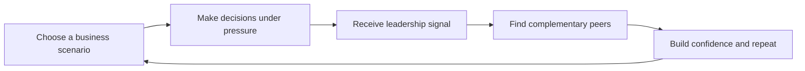

# Acumen master report handoff and Claude prompt

This is the one file to use for report drafting. It combines the Claude prompt, report assembly guide, design system, screenshot plan, diagram plan, source audit, marking strategy, and final cohesion rules.

Copy the section titled **Claude Prompt** into Claude when you want it to generate the report draft.

## Current project verdict

The project is cohesive enough to start writing.

The strongest version is:

**Acumen helps emerging business leaders practise realistic decisions, understand their leadership tendencies, and connect with peers whose strengths complement their own.**

The report should explain:

- **Beachhead:** business students, young professionals, and aspiring founders.
- **Premium later segment:** NextGen family-business successors.
- **Research anchor:** APAC family-business succession, governance, and leadership readiness.
- **MVP proof:** simulation, feedback, profile, and peer matching.
- **Honest limitation:** scores are research-informed, not externally validated yet.

This gives the marker a clean line from research to product to feasibility.

## What is left to do

1. Add final survey results.
2. Add two exploratory interviews.
3. Convert survey and interview findings into one small chart, 2 to 4 short quotes, and a short validation summary.
4. Assemble the report using this file.
5. Check every major claim has a citation.
6. Final pass for no em dashes, no overclaiming, and consistent Acumen wording.

## Files and assets to use

Use these assets while writing:

| Asset | Use |
| --- | --- |
| `report_screenshots/acumen-01-home.png` | Product definition |
| `report_screenshots/acumen-02-onboarding.png` | MVP walkthrough |
| `report_screenshots/acumen-04-simulation.png` | MVP walkthrough |
| `report_screenshots/acumen-05-feedback.png` | MVP walkthrough |
| `report_screenshots/acumen-07-network.png` | Product loop or customer value |
| `report_screenshots/acumen-06-profile.png` | Appendix or MVP evidence |
| `report_screenshots/acumen-03-dashboard.png` | Appendix |

Use these files only if extra context is needed:

| File | Purpose |
| --- | --- |
| `COHESIVE_REPORT_PACK.md` | Main narrative, section lengths, interview logic, SWOT and Porter wording |
| `SOURCE_AUDIT_AND_REPORT_LAYOUT.md` | Source-safe claims and bibliography targets |
| `PRODUCT_LOOP_AND_MVP_WALKTHROUGH.md` | Product loop and screenshot order |
| `REPORT_DIAGRAMS_DRAFT.md` | Diagram-ready product loop, SWOT, and Porter tables |
| `REPORT_ASSEMBLY_GUIDE.md` | Older checklist, now superseded by this file |
| `CLAUDE_REPORT_PROMPT.md` | Older Claude prompt, now superseded by this file |

Do not paste raw research dumps directly into the report.

## Design system for the report

The report should visually match the Acumen app.

### Colour palette

Use a restrained editorial business palette:

| Use | Colour |
| --- | --- |
| Warm off-white background | `#F7F3EC` |
| Ink black headings | `#111111` |
| Soft charcoal body text | `#4A4640` |
| Deep green accent | `#123F36` or `#0F3D34` |
| Terracotta action accent | `#D45F43` |
| Pale sage highlight | `#DCE9E4` |
| Fine borders | `#E3DCD1` |

Avoid bright gradients, purple tech colours, dark-blue corporate templates, neon accents, and generic startup visuals.

### Typography

Preferred font:

**Inter**

Fallbacks:

**Aptos**, **Helvetica Neue**, or **Arial**

Suggested hierarchy:

| Element | Size |
| --- | --- |
| Cover title | 40 to 52 pt, bold |
| Section headings | 22 to 28 pt, bold |
| Subheadings | 14 to 16 pt, semibold |
| Body text | 10.5 to 11.5 pt |
| Captions | 8.5 to 9.5 pt |
| Diagram labels | 9 to 11 pt |

Keep headings short and intentional. Avoid dense academic walls of text.

### Layout rules

Use:

- Wide margins.
- Strong whitespace.
- Two-column layouts where useful.
- Compact tables.
- Pull quotes from interviews.
- Numbered figure captions.
- Screenshot strips for the MVP walkthrough.
- Clean diagrams with simple arrows and boxes.

Avoid:

- Low-resolution collages.
- Giant paragraphs.
- Long SWOT or Porter prose.
- Overcrowded canvases.
- Repeating the same claim in several sections.
- Making every page look like a card layout.

## Report structure

Target around 3,000 words unless the coursework brief says otherwise.

### Cover page

Include:

- Product name: **Acumen**
- Tagline: **Practise judgement before it counts**
- One-line definition
- Group details
- Course/module details
- Date

Visual style:

Use a large product name, one-line definition, and a small product loop graphic or app screenshot.

### 1. Executive summary

Target: 250 to 300 words.

Include:

- Problem.
- Target users.
- Solution.
- MVP.
- Business model direction.
- Feasibility verdict.

Must include:

**Acumen is feasible as an early MVP because it demonstrates the core loop of simulation, feedback, and peer discovery. However, further user testing and scoring validation are required before it can be positioned as a high-stakes assessment tool.**

### 2. Scope and opportunity

Target: 250 to 350 words.

Explain:

- Young people need practical ways to build business judgement.
- APAC family-business succession creates a high-value leadership-readiness context.
- The initial beachhead is broader than family-business successors because students and young professionals are easier to reach, test with, and convert into early users.

Use source-backed claims from the source section below.

### 3. Product definition

Target: 300 to 400 words.

Define Acumen clearly.

Use:

**Acumen helps emerging business leaders practise realistic decisions, understand their leadership tendencies, and connect with peers whose strengths complement their own.**

Include the product loop:

**Simulate -> Signal -> Connect -> Improve**

Explain:

1. **Simulate:** the user completes a realistic business scenario.
2. **Signal:** Acumen turns decisions into a leadership profile.
3. **Connect:** users see peers with complementary skills.
4. **Improve:** users repeat scenarios and track progress.

### 4. MVP walkthrough

Target: 350 to 450 words plus screenshots.

Use a scenario walkthrough, not a collage.

The walkthrough should show:

1. User lands on Acumen.
2. User onboards around goals and skills.
3. User enters **The Succession Crisis** scenario.
4. User makes decisions under pressure.
5. User receives a leadership signal.
6. User sees peer matches.
7. User can repeat the loop.

Screenshot placement:

| Screenshot | Placement | Caption |
| --- | --- | --- |
| `report_screenshots/acumen-01-home.png` | Product definition | Acumen introduces a simple promise: practise business judgement before it counts. |
| `report_screenshots/acumen-02-onboarding.png` | MVP walkthrough | Onboarding frames the experience around goals and skill development. |
| `report_screenshots/acumen-04-simulation.png` | MVP walkthrough | The simulation places users in realistic trade-off decisions. |
| `report_screenshots/acumen-05-feedback.png` | MVP walkthrough | Feedback converts choices into a research-informed leadership signal. |
| `report_screenshots/acumen-07-network.png` | Product loop or value section | Peer matching turns individual feedback into social learning. |
| `report_screenshots/acumen-06-profile.png` | Appendix or MVP evidence | The profile shows repeat use and progress tracking. |
| `report_screenshots/acumen-03-dashboard.png` | Appendix | The dashboard supports navigation but is not essential to the main story. |

Recommended caption for the screenshot sequence:

**The MVP walkthrough shows Acumen's core loop: a user enters through a simple value proposition, completes a business simulation, receives a leadership signal, and is guided toward peers with complementary strengths.**

### 5. Business model and value proposition

Target: 350 to 450 words.

Use the BMC and Value Proposition Canvas, but explain their relationship clearly:

- The BMC describes the broad beachhead: business students, young professionals, and aspiring founders.
- The VPC is more focused on the premium later segment: NextGen family-business successors.
- This is a staged market entry strategy, not a contradiction.

Include a simple Now / Next / Later table:

| Now | Next | Later |
| --- | --- | --- |
| Simulations | More scenarios | Institutional pilots |
| Feedback profile | Better matching logic | Certificates |
| Peer discovery | University cohort testing | NextGen succession pathway |
| Progress profile | Survey and interview validation | B2B advisory or recruiter tools |

Make clear that CV parsing, global map matching, paid certificates, recruiter dashboards, and fully validated scoring are roadmap features, not current MVP features.

### 6. Market validation

Target: 400 to 500 words.

Use survey findings and two exploratory interviews.

Use this wording:

**Two exploratory interviews were used to test early assumptions about the problem and value proposition. These findings are directional rather than conclusive, so the report combines them with survey responses, secondary research, and prototype feedback. Broader validation remains a next step.**

Include:

- One compact survey chart or table.
- 2 to 4 short anonymised interview quotes.
- What changed because of validation.
- What still needs to be tested.

Do not pretend two interviews prove demand.

### 7. Market attractiveness

Target: 450 to 600 words.

Use concise SWOT and Porter diagrams or tables. Do not write long SWOT or Porter paragraphs.

Main SWOT interpretation:

**The SWOT shows that Acumen's near-term advantage is clarity and usability, while its main risk is credibility. The report should therefore present validation honestly and frame institutional use as a later-stage opportunity.**

Main Porter interpretation:

**Porter's analysis suggests that Acumen should compete through credible scenario design and user trust rather than claiming a technology moat too early.**

### 8. Feasibility and next steps

Target: 300 to 450 words.

Give a balanced verdict:

- Technically feasible as an MVP.
- Strategically coherent if launched through students and societies first.
- Commercially promising but not yet proven.
- Research-backed, but scoring validation remains a key limitation.

Next steps:

1. Run more user testing.
2. Refine the scoring explanation.
3. Add more scenarios.
4. Test cohort use through a university or entrepreneurship society.
5. Develop better peer-matching logic.
6. Later, test the NextGen family-business pathway.

### Appendix

Include:

- Full BMC.
- Full Value Proposition Canvas.
- Extra screenshots.
- Survey questions and results.
- Interview guide.
- Interview notes.
- Source audit summary.
- Technical architecture if available.

### Bibliography

Use Harvard style.

Use the source-safe wording below to avoid weak claims.

## Diagrams to include

Do not include every possible diagram. Prioritise clarity.

### Diagram 1: Product loop

Title:

**Acumen product loop**

Caption:

**Acumen turns business learning into a repeatable loop: users practise realistic decisions, receive feedback, connect with useful peers, and return to improve.**

### Diagram 2: MVP walkthrough

Title:

**Typical Acumen use case**

Caption:

**The MVP is best shown as a use-case walkthrough because it makes the product logic clearer than a loose collage.**

### Diagram 3: SWOT

Use this as a compact 2x2 visual table.

| Strengths | Weaknesses |
| --- | --- |
| Clear simulation-based MVP | Scoring is research-informed, not validated |
| Strong link to leadership readiness research | Peer matching is still demo data |
| Broad student beachhead with premium NextGen pathway | Some roadmap features are not implemented |
| Differentiated blend of decision practice and networking | Needs more user testing before stronger claims |

| Opportunities | Threats |
| --- | --- |
| Universities and entrepreneurship societies can provide early cohorts | Generic AI coaching tools may look like substitutes |
| APAC family-business succession creates a high-value later market | McKinsey, LinkedIn, Coursera, or assessment firms could move into simulations |
| Simulations can become more culturally specific over time | Weak validation could damage credibility |
| Peer network can create retention if enough users join | Users may see feedback as generic if the product is not explained well |

### Diagram 4: Porter's Five Forces

Use this as a concise table or a five-force wheel.

| Force | Pressure | Report point |
| --- | --- | --- |
| Competitive rivalry | Medium | Few direct competitors combine simulations, feedback, and peer matching, but adjacent learning platforms are strong. |
| Threat of substitutes | High | Users can use AI tutors, LinkedIn Learning, Coursera, mentoring, or case practice instead. |
| Buyer power | Medium | Students are price sensitive, but universities and societies can aggregate demand. |
| Supplier power | Medium | Scenario quality, assessment design, and institutional credibility depend on expert input. |
| Threat of new entrants | Medium to high | The interface is easy to copy, but credible scoring, contextual scenarios, and network density are harder to build. |

### Optional diagram: Evidence map

Use only if space allows.

| Research finding | Product decision |
| --- | --- |
| Succession and governance are high-stakes in APAC family businesses | Use succession and governance scenarios as premium content |
| Young users need practical business learning | Launch with short simulations rather than long courses |
| Serious games can support soft-skill assessment | Use interactive decision simulations |
| Peer networks support learning and opportunity discovery | Add complementary peer matching |
| Assessment validity takes time | Frame scoring as research-informed, not validated |

## Source-safe claims

### Safe claims to use

**APAC wealth transfer**

Between 2023 and 2030, high-net-worth and ultra-high-net-worth families in Asia Pacific are expected to transfer around USD 5.8 trillion to the next generation.

Use for:

Why the premium later segment, NextGen family business successors, matters.

Source:

McKinsey & Company, *Asia-Pacific's family office boom: Opportunity knocks*, 2024.

**Indonesian succession resistance**

PwC reports that leadership transition remains a challenge for Indonesian family businesses, with 43% of Indonesian NextGen citing senior resistance and 19% of businesses delaying succession due to uncertainty.

Use for:

Why succession and leadership readiness are a high-stakes scenario context.

Source:

PwC Indonesia, *How Indonesian family businesses are preparing their legacy, and how agile they are amidst uncertainty*, 2025.

**PwC NextGen survey sample**

PwC's Global NextGen Survey 2024 collected 917 interviews across 63 territories, including 310 interviews across 13 Asia Pacific territories.

Use for:

Evidence that NextGen family-business leadership is a documented research area.

Source:

PwC, *Global NextGen Survey 2024: Asia Pacific highlights*.

**Serious games and soft skills**

Serious games have been used to assess or develop soft skills such as problem solving, teamwork, time management, decision-making, and communication.

Use for:

Justifying why a simulation is more than a gimmick.

Source:

JMIR Serious Games, *Gamification and Soft Skills Assessment in the Development of a Serious Game: Design and Feasibility Pilot Study*, 2023.

**Political connections in Indonesia**

Fisman's American Economic Review paper estimated the market value of political connections in Indonesia by studying stock market reactions to news about Suharto's health.

Use for:

Contextualising why governance, political ties, and succession matter in Indonesian family business scenarios.

Source:

Fisman, R. (2001), *Estimating the Value of Political Connections*, American Economic Review, 91(4), pp. 1095-1102.

### Claims that need careful wording

**Family companies in Indonesia contribute more than 80% of GDP**

Use:

**Sukamdani's (2023) review of Southeast Asian family-business literature states that Indonesian family companies reach around 40% of market capitalisation and contribute more than 80% of GDP, underlining why succession quality has wider economic significance.**

Even safer:

**Family businesses are widely described as central to Indonesia's economy, with Sukamdani (2023) citing their major role in market capitalisation and GDP.**

Source:

Sukamdani, N.B. (2023) *Family Business Dynamics in Southeast Asia: A Comparative Study of Indonesia, Malaysia, Singapore, and Thailand*, Journal of ASEAN Studies, 11(1), pp. 197-218. DOI: 10.21512/jas.v11i1.9518.

**Family businesses in Indonesia reach 40% of market capitalisation**

Use:

**Sukamdani (2023) cites Indonesian family companies as reaching around 40% of market capitalisation.**

Do not overuse this number. It should support the context, not carry the whole market argument.

**McKinsey has a 25-person Game-Based Innovation Lab**

Use:

**McKinsey's own account of its Game-Based Innovation Lab shows that game-based assessment and learning are being used in serious professional contexts, not only entertainment.**

Source:

McKinsey & Company (2025) *From apprenticeship in space to selecting microbes: Meet McKinsey's game-based innovation lab*.

**Imbellus scores were validated through McKinsey employees from 2017 onwards**

Do not use that wording.

Use:

**Imbellus and McKinsey provide a useful analogy for simulation-based assessment. Their 2017 pilot used candidate data to calibrate and refine scoring, but Acumen does not claim equivalent validation at MVP stage.**

Better:

**Imbellus piloted and calibrated simulation-based assessment with McKinsey candidates from 2017, showing the level of validation work required before such scores can be treated as high-stakes assessment evidence.**

Sources:

McKinsey & Company (2020) *Innovating recruiting through online gaming*.

Kantar, R. et al. (2018) *Constructing Cognitive Profiles for Simulation-Based Hiring Assessments*, Educational Data Mining.

## Core bibliography

Use Harvard style consistently.

1. PwC (2025) *How Indonesian family businesses are preparing their legacy, and how agile they are amidst uncertainty*.
2. PwC (2024) *Global NextGen Survey 2024: Asia Pacific highlights*.
3. McKinsey & Company (2024) *Asia-Pacific's family office boom: Opportunity knocks*.
4. McKinsey & Company (2025) *From apprenticeship in space to selecting microbes: Meet McKinsey's game-based innovation lab*.
5. McKinsey & Company (2020) *Innovating recruiting through online gaming*.
6. EY and University of St.Gallen (2025) *Global 500 Family Business Index*.
7. Sukamdani, N.B. (2023) *Family Business Dynamics in Southeast Asia: A Comparative Study of Indonesia, Malaysia, Singapore, and Thailand*. Journal of ASEAN Studies, 11(1), pp. 197-218.
8. Kantar, R. et al. (2018) *Constructing Cognitive Profiles for Simulation-Based Hiring Assessments*. Educational Data Mining.
9. Fisman, R. (2001) *Estimating the Value of Political Connections*. American Economic Review, 91(4), pp. 1095-1102.
10. Hambrick, D.C. and Mason, P.A. (1984) *Upper Echelons: The Organization as a Reflection of Its Top Managers*. Academy of Management Review.
11. Vroom, V.H. and Yetton, P.W. (1973) *Leadership and Decision-Making*.
12. Hersey, P. and Blanchard, K.H. (1969 or later edition) *Situational Leadership*.
13. Rest, J.R. (1986) *Moral Development: Advances in Research and Theory*.
14. JMIR Serious Games (2023) *Gamification and Soft Skills Assessment in the Development of a Serious Game: Design and Feasibility Pilot Study*.

## Scenario status

The app has three web scenarios:

- **The Succession Crisis**
- **The Fading Division**
- **The Authority Bypass**

Use **The Succession Crisis** in the report because it most directly links to the APAC family-business research.

## What not to overclaim

Do not say:

**Acumen provides validated psychometric assessment.**

Use:

**Acumen provides research-informed developmental feedback, with validation required before high-stakes use.**

Do not say:

**The MVP has AI-powered matching, CV parsing, global network visualisation, and recruiter tools.**

Use:

**The MVP demonstrates the core simulation-feedback-peer loop, while CV parsing, global maps, recruiter tools, certificates, and deeper matching are roadmap features.**

Do not say:

**The interviews prove demand.**

Use:

**The interviews provide directional evidence that informed early assumptions.**

## Marking strategy

The report should score well if it shows:

- Clear product-market logic.
- Strong link between research and MVP.
- Honest feasibility analysis.
- Visual evidence of the prototype.
- Source-backed market claims.
- Thoughtful business model.
- Clear limitations and next steps.
- Coherent design language.

The biggest risk is overclaiming validation. Avoid that.

The strongest message is:

**Acumen is a feasible early-stage MVP with a coherent beachhead, a research-backed premium pathway, and a clear product loop. Its next challenge is not building more features, but validating whether users trust and return to the simulation-feedback-peer loop.**

## Claude Prompt

Copy everything below into Claude.

---

You are helping write and design a high-scoring university group coursework report for an MVP called **Acumen**.

Acumen is a feasibility prototype for emerging business leaders. It helps users practise realistic business decisions, receive a research-informed leadership signal, and connect with peers whose strengths complement their own.

The report must be cohesive, visually clean, concise, and evidence-led. It should follow the structure and visual discipline of a strong exemplar report: clear product identity, short sections, diagrams, screenshots, compact analysis, and source-backed claims.

Do not use em dashes. Write in a human academic/business style, not robotic or over-marketed. Do not overclaim what the MVP does.

Use the following core positioning:

**Acumen helps emerging business leaders practise realistic decisions, understand their leadership tendencies, and connect with peers whose strengths complement their own.**

The strategic logic is:

- **Beachhead:** business students, young professionals, and aspiring founders.
- **Premium later segment:** NextGen family-business successors.
- **Research anchor:** APAC family-business succession, governance, and leadership readiness.
- **MVP proof:** simulation, feedback, profile, and peer matching.
- **Limitation:** scoring is research-informed, not externally validated yet.

Write the report around this argument:

**Research shows a leadership-readiness gap. Acumen tests whether short simulations can help emerging leaders practise judgement, receive useful feedback, and form more valuable peer connections.**

Design the report to match the Acumen app:

- Warm off-white background: `#F7F3EC`
- Ink black headings: `#111111`
- Soft charcoal body text: `#4A4640`
- Deep green accent: `#123F36` or `#0F3D34`
- Terracotta action accent: `#D45F43`
- Pale sage highlight: `#DCE9E4`
- Fine borders: `#E3DCD1`
- Font: Inter preferred, or Aptos, Helvetica Neue, Arial
- Use wide margins, whitespace, compact tables, screenshot strips, and simple diagrams.
- Avoid bright gradients, generic startup neon colours, dense paragraphs, and long SWOT or Porter prose.

Use this report structure:

1. **Cover page**
   Product name: Acumen. Tagline: Practise judgement before it counts. Include one-line definition, group details, module details, and date.

2. **Executive summary**
   250 to 300 words. Include problem, target users, solution, MVP, business model direction, and feasibility verdict.

3. **Scope and opportunity**
   250 to 350 words. Explain the leadership-readiness problem, APAC family-business succession as a high-value context, and why the beachhead is broader than family-business successors.

4. **Product definition**
   300 to 400 words. Define Acumen and include the product loop: **Simulate -> Signal -> Connect -> Improve**.

5. **MVP walkthrough**
   350 to 450 words plus screenshots. Use a scenario walkthrough, not a collage. The sequence is landing page, onboarding, The Succession Crisis simulation, feedback, network, repeat.

6. **Business model and value proposition**
   350 to 450 words. Explain that the BMC is the broad beachhead and the VPC is the premium later segment. Include a Now / Next / Later roadmap.

7. **Market validation**
   400 to 500 words. Use survey results and two exploratory interviews. Do not claim they prove demand. Include one survey chart or table and 2 to 4 short anonymised quotes.

8. **Market attractiveness**
   450 to 600 words. Use compact SWOT and Porter's Five Forces diagrams or tables. Add one interpretation sentence under each.

9. **Feasibility and next steps**
   300 to 450 words. Give a balanced feasibility verdict and next steps.

10. **Appendix**
   Include BMC, VPC, extra screenshots, survey questions, interview notes, source audit summary, and technical architecture if available.

11. **Bibliography**
   Use Harvard style.

Use these screenshots:

| Screenshot | Placement | Caption |
| --- | --- | --- |
| `report_screenshots/acumen-01-home.png` | Product definition | Acumen introduces a simple promise: practise business judgement before it counts. |
| `report_screenshots/acumen-02-onboarding.png` | MVP walkthrough | Onboarding frames the experience around goals and skill development. |
| `report_screenshots/acumen-04-simulation.png` | MVP walkthrough | The simulation places users in realistic trade-off decisions. |
| `report_screenshots/acumen-05-feedback.png` | MVP walkthrough | Feedback converts choices into a research-informed leadership signal. |
| `report_screenshots/acumen-07-network.png` | Product loop or value section | Peer matching turns individual feedback into social learning. |
| `report_screenshots/acumen-06-profile.png` | Appendix or MVP evidence | The profile shows repeat use and progress tracking. |
| `report_screenshots/acumen-03-dashboard.png` | Appendix | The dashboard supports navigation but is not essential to the main story. |

Use these diagrams:

1. Product loop: **Simulate -> Signal -> Connect -> Improve**
2. MVP walkthrough: user -> onboarding -> simulation -> feedback -> network -> repeat
3. SWOT 2x2 table
4. Porter's Five Forces compact table or wheel
5. Optional Now / Next / Later roadmap
6. Optional evidence map: research finding -> product decision

Use this SWOT:

| Strengths | Weaknesses |
| --- | --- |
| Clear simulation-based MVP | Scoring is research-informed, not validated |
| Strong link to leadership readiness research | Peer matching is still demo data |
| Broad student beachhead with premium NextGen pathway | Some roadmap features are not implemented |
| Differentiated blend of decision practice and networking | Needs more user testing before stronger claims |

| Opportunities | Threats |
| --- | --- |
| Universities and entrepreneurship societies can provide early cohorts | Generic AI coaching tools may look like substitutes |
| APAC family-business succession creates a high-value later market | McKinsey, LinkedIn, Coursera, or assessment firms could move into simulations |
| Simulations can become more culturally specific over time | Weak validation could damage credibility |
| Peer network can create retention if enough users join | Users may see feedback as generic if the product is not explained well |

Use this Porter table:

| Force | Pressure | Report point |
| --- | --- | --- |
| Competitive rivalry | Medium | Few direct competitors combine simulations, feedback, and peer matching, but adjacent learning platforms are strong. |
| Threat of substitutes | High | Users can use AI tutors, LinkedIn Learning, Coursera, mentoring, or case practice instead. |
| Buyer power | Medium | Students are price sensitive, but universities and societies can aggregate demand. |
| Supplier power | Medium | Scenario quality, assessment design, and institutional credibility depend on expert input. |
| Threat of new entrants | Medium to high | The interface is easy to copy, but credible scoring, contextual scenarios, and network density are harder to build. |

Use this source-safe wording:

**Sukamdani's (2023) review of Southeast Asian family-business literature states that Indonesian family companies reach around 40% of market capitalisation and contribute more than 80% of GDP.**

**McKinsey's Game-Based Innovation Lab shows that simulation-based assessment and learning are used in serious professional contexts, not only entertainment.**

**Imbellus and McKinsey piloted and calibrated simulation-based assessment with McKinsey candidates from 2017, but Acumen does not claim equivalent validation at MVP stage.**

Do not write:

**Imbellus scores were validated on McKinsey employees from 2017 onwards.**

Do not write:

**Acumen provides validated psychometric assessment.**

Instead write:

**Acumen provides research-informed developmental feedback, with validation required before high-stakes use.**

Use this validation wording:

**Two exploratory interviews were used to test early assumptions about the problem and value proposition. These findings are directional rather than conclusive, so the report combines them with survey responses, secondary research, and prototype feedback. Broader validation remains a next step.**

Use this core bibliography:

1. PwC (2025) *How Indonesian family businesses are preparing their legacy, and how agile they are amidst uncertainty*.
2. PwC (2024) *Global NextGen Survey 2024: Asia Pacific highlights*.
3. McKinsey & Company (2024) *Asia-Pacific's family office boom: Opportunity knocks*.
4. McKinsey & Company (2025) *From apprenticeship in space to selecting microbes: Meet McKinsey's game-based innovation lab*.
5. McKinsey & Company (2020) *Innovating recruiting through online gaming*.
6. EY and University of St.Gallen (2025) *Global 500 Family Business Index*.
7. Sukamdani, N.B. (2023) *Family Business Dynamics in Southeast Asia: A Comparative Study of Indonesia, Malaysia, Singapore, and Thailand*. Journal of ASEAN Studies, 11(1), pp. 197-218.
8. Kantar, R. et al. (2018) *Constructing Cognitive Profiles for Simulation-Based Hiring Assessments*. Educational Data Mining.
9. Fisman, R. (2001) *Estimating the Value of Political Connections*. American Economic Review, 91(4), pp. 1095-1102.
10. Hambrick, D.C. and Mason, P.A. (1984) *Upper Echelons: The Organization as a Reflection of Its Top Managers*. Academy of Management Review.
11. Vroom, V.H. and Yetton, P.W. (1973) *Leadership and Decision-Making*.
12. Hersey, P. and Blanchard, K.H. (1969 or later edition) *Situational Leadership*.
13. Rest, J.R. (1986) *Moral Development: Advances in Research and Theory*.
14. JMIR Serious Games (2023) *Gamification and Soft Skills Assessment in the Development of a Serious Game: Design and Feasibility Pilot Study*.

Final marking strategy:

The report should show clear product-market logic, strong linkage between research and MVP, honest feasibility analysis, source-backed claims, visual prototype evidence, and clear limitations. The biggest risk is overclaiming validation, so avoid that. The strongest final message is:

**Acumen is a feasible early-stage MVP with a coherent beachhead, a research-backed premium pathway, and a clear product loop. Its next challenge is not building more features, but validating whether users trust and return to the simulation-feedback-peer loop.**

---

