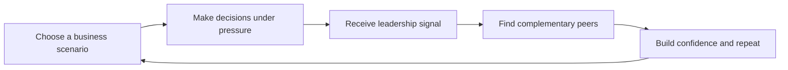
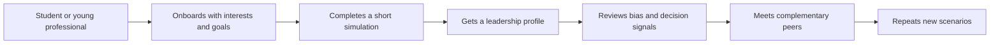

# Report diagrams draft

These are concise diagram-ready versions of the product loop, SWOT, and Porter's Five Forces. They are written to support the report rather than replace analysis.

## Product loop

Diagram title:

**Acumen product loop**

Caption:

**Acumen turns business learning into a repeatable loop: users practise realistic decisions, receive feedback, connect with useful peers, and return to improve.**

## MVP walkthrough diagram

Diagram title:

**Typical Acumen use case**

Caption:

**The MVP should be shown as a use-case walkthrough, not as a loose collage. This makes the product logic clearer and helps the screenshots feel like evidence.**

## SWOT for main report

Use this as a compact visual table.

| Strengths | Weaknesses |
| --- | --- |
| Clear simulation-based MVP | Scoring is research-informed, not validated |
| Strong link to leadership readiness research | Peer matching is still demo data |
| Broad student beachhead with premium NextGen pathway | Some roadmap features are not implemented |
| Differentiated blend of decision practice and networking | Needs more user testing before stronger claims |

| Opportunities | Threats |
| --- | --- |
| Universities and entrepreneurship societies can provide early cohorts | Generic AI coaching tools may look like substitutes |
| APAC family-business succession creates a high-value later market | McKinsey, LinkedIn, Coursera, or assessment firms could move into simulations |
| Simulations can become more culturally specific over time | Weak validation could damage credibility |
| Peer network can create retention if enough users join | Users may see feedback as generic if the product is not explained well |

One-sentence interpretation:

**The SWOT shows that Acumen's near-term advantage is clarity and usability, while its main risk is credibility. The report should therefore present validation honestly and frame institutional use as a later-stage opportunity.**

## Porter's Five Forces for main report

Use this as a concise force map or table.

| Force | Pressure | Report point |
| --- | --- | --- |
| Competitive rivalry | Medium | Few direct competitors combine simulations, feedback, and peer matching, but adjacent learning platforms are strong. |
| Threat of substitutes | High | Users can use AI tutors, LinkedIn Learning, Coursera, mentoring, or case practice instead. |
| Buyer power | Medium | Students are price sensitive, but universities and societies can aggregate demand. |
| Supplier power | Medium | Scenario quality, assessment design, and institutional credibility depend on expert input. |
| Threat of new entrants | Medium to high | The interface is easy to copy, but credible scoring, contextual scenarios, and network density are harder to build. |

One-sentence interpretation:

**Porter's analysis suggests that Acumen should compete through credible scenario design and user trust rather than claiming a technology moat too early.**

## How these diagrams should appear in the report

Put the product loop and use-case walkthrough in the product definition or MVP section.

Put SWOT and Porter's Five Forces in the market attractiveness section.

Keep the main report visual and concise. Put longer explanation in the appendix if needed.

